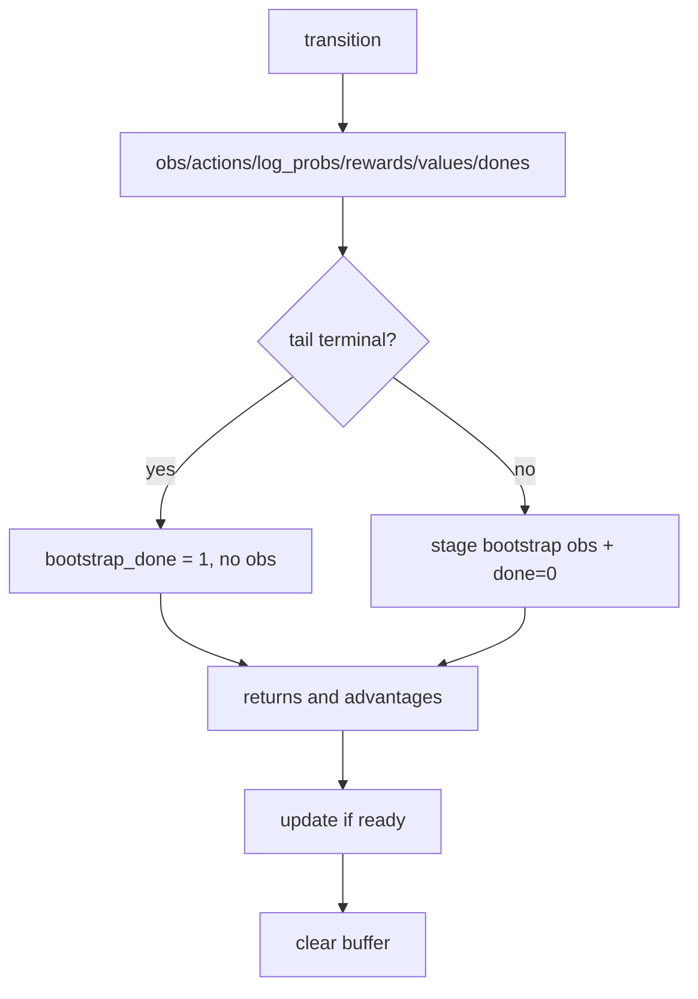

# Buffer / Bootstrap / Update Flow

> Owning document: [PPO buffers, bootstrap, and update cadence](../../../04_learning/01_ppo_buffers_bootstrap_and_update_cadence.md)

## What this asset shows
- the buffer fields and closure paths

## What this asset intentionally omits
- exact per-field tensor dtypes

