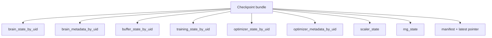

# Checkpoint-Visible Learning-State Map

> Owning document: [Checkpoint-visible learning state and restore order](../../../04_learning/04_checkpoint_visible_learning_state_and_restore_order.md)

## What this asset shows
- learning surfaces that enter the checkpoint bundle

## What this asset intentionally omits
- non-learning registry/grid state details

