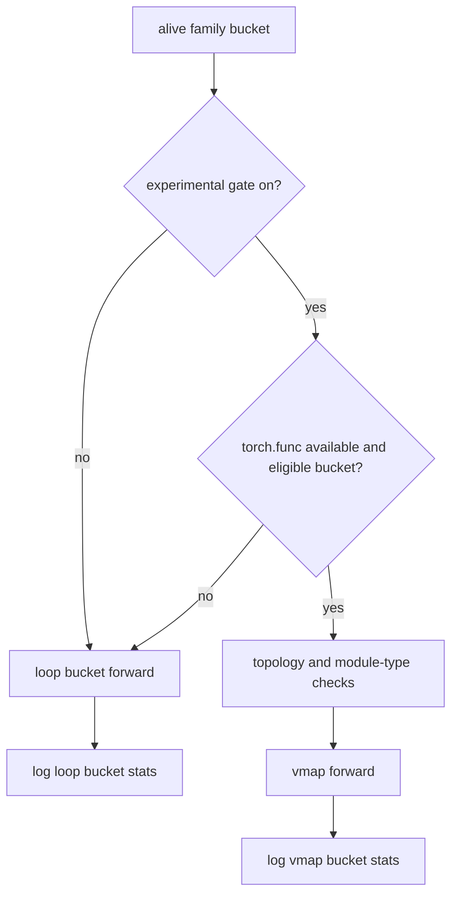

# Inference Path Comparison

> Owning document: [Inference execution paths: loop versus family-vmap](../../../04_learning/03_inference_execution_paths_loop_vs_family_vmap.md)

## What this asset shows
- the decision split between baseline loop execution and optional family-vmap execution

## What this asset intentionally omits
- measured performance outcomes

