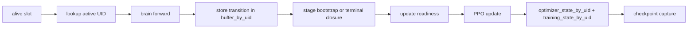

# UID-Owned PPO Lifecycle Panel

> Owning document: [Learning system overview and data ownership](../../../04_learning/00_learning_system_overview_and_data_ownership.md)

## What this asset shows
- the lifetime of PPO state under UID ownership

## What this asset intentionally omits
- optimizer math details

