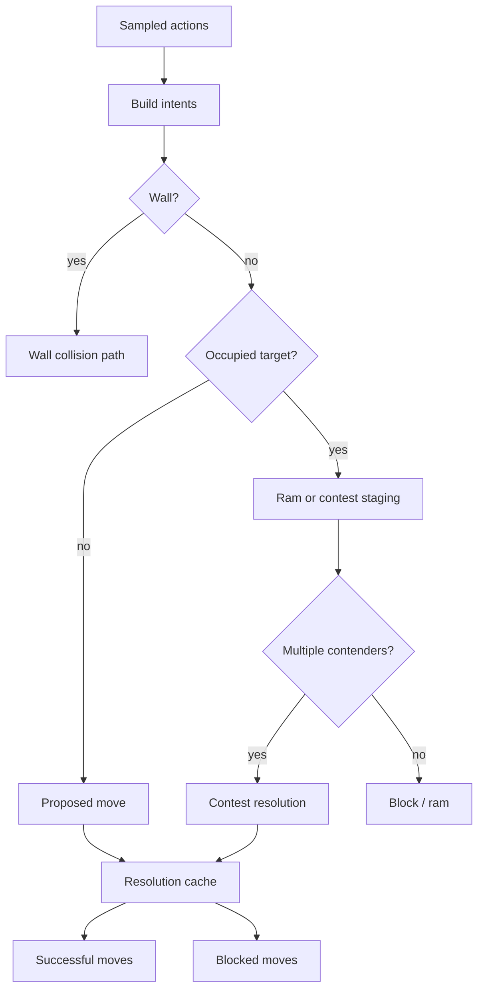

# Action-Resolution Flow

> Owning document: [Action surface, intents, and move resolution](../../../03_mechanics/05_action_surface_intents_and_move_resolution.md)

## What this asset shows
- how actions become intents, contests, rams, or approved moves

## What this asset intentionally omits
- reward and PPO storage after movement

