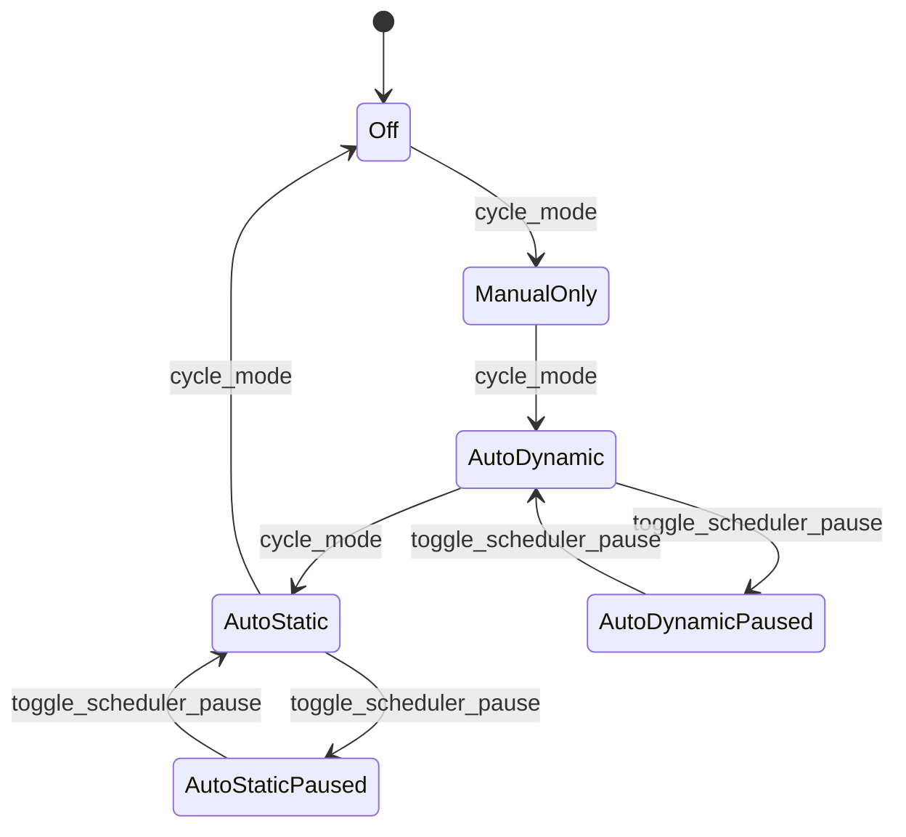

# Catastrophe Scheduler State Map

> Owning document: [Catastrophe system, scheduler, and world overlays](../../../03_mechanics/08_catastrophe_system_scheduler_and_world_overlays.md)

## What this asset shows
- catastrophe mode truth and scheduler-armed / paused semantics

## What this asset intentionally omits
- per-catastrophe parameter details

