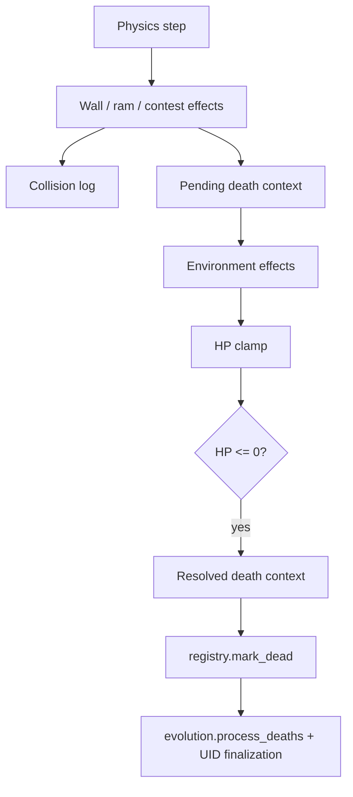

# Collision and Death-Context Flow

> Owning document: [Physics, collisions, damage, healing, and death](../../../03_mechanics/06_physics_collisions_damage_healing_and_death.md)

## What this asset shows
- how collisions and environment effects stage death context before final death processing

## What this asset intentionally omits
- detailed numeric damage formulas

