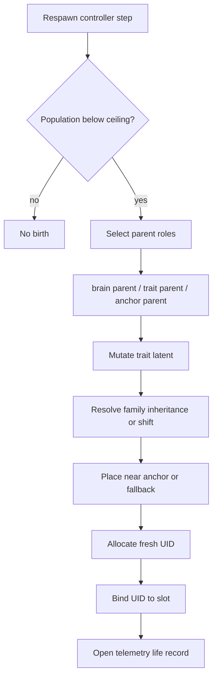

# Respawn and Lineage Flow

> Owning document: [Reproduction, respawn, mutation, and lineage](../../../03_mechanics/07_reproduction_respawn_mutation_and_lineage.md)

## What this asset shows
- parent-role selection, mutation, placement, and fresh-UID birth

## What this asset intentionally omits
- full overlay policy branches

