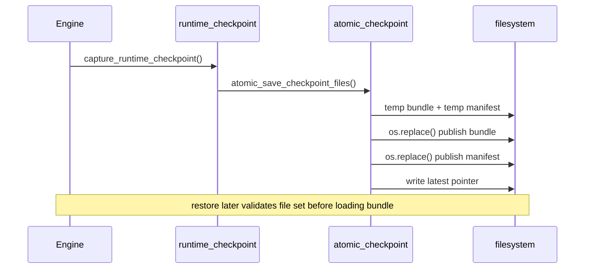

# Checkpoint Publish and Restore Sequence

> Owning document: [Checkpointing, manifests, restore, and latest pointer](../../../05_operations/03_checkpointing_manifests_restore_and_latest_pointer.md)

## What this asset shows
- the operator-visible file-set lifecycle around checkpoint publication and restore

## What this asset intentionally omits
- every internal validation branch

