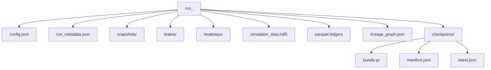

# Run Directory Artifact Tree

> Owning document: [Run directory artifacts and file outputs](../../../05_operations/02_run_directory_artifacts_and_file_outputs.md)

## What this asset shows
- the major folders and files created around a run

## What this asset intentionally omits
- every optional artifact variant

