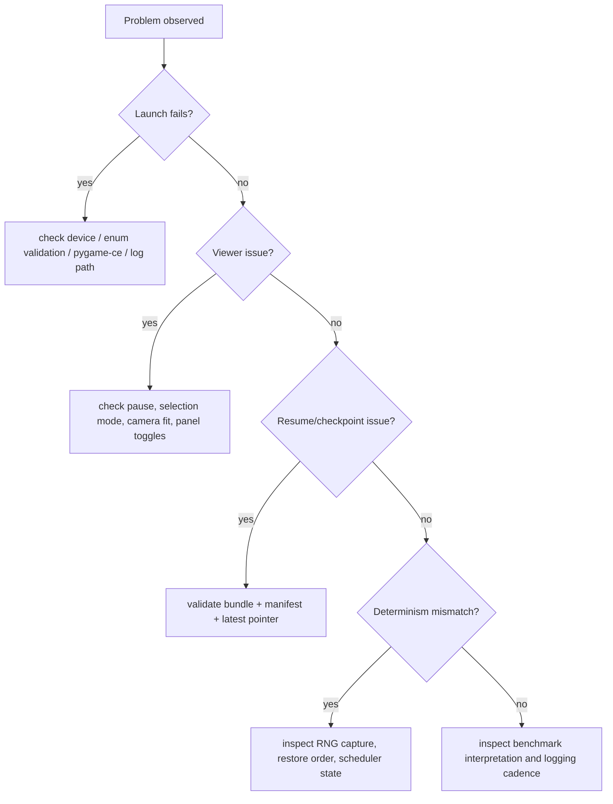

# Troubleshooting Decision Tree

> Owning document: [Troubleshooting and failure atlas](../../../05_operations/08_troubleshooting_and_failure_atlas.md)

## What this asset shows
- a compact first-check tree for common operational failures

## What this asset intentionally omits
- low-level code debugging recipes

