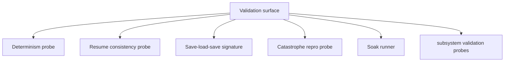

# Validation Harness Matrix

> Owning document: [Validation, determinism, resume consistency, and soak](../../../05_operations/05_validation_determinism_resume_consistency_and_soak.md)

## What this asset shows
- the main validation harness families

## What this asset intentionally omits
- exact test implementation content

