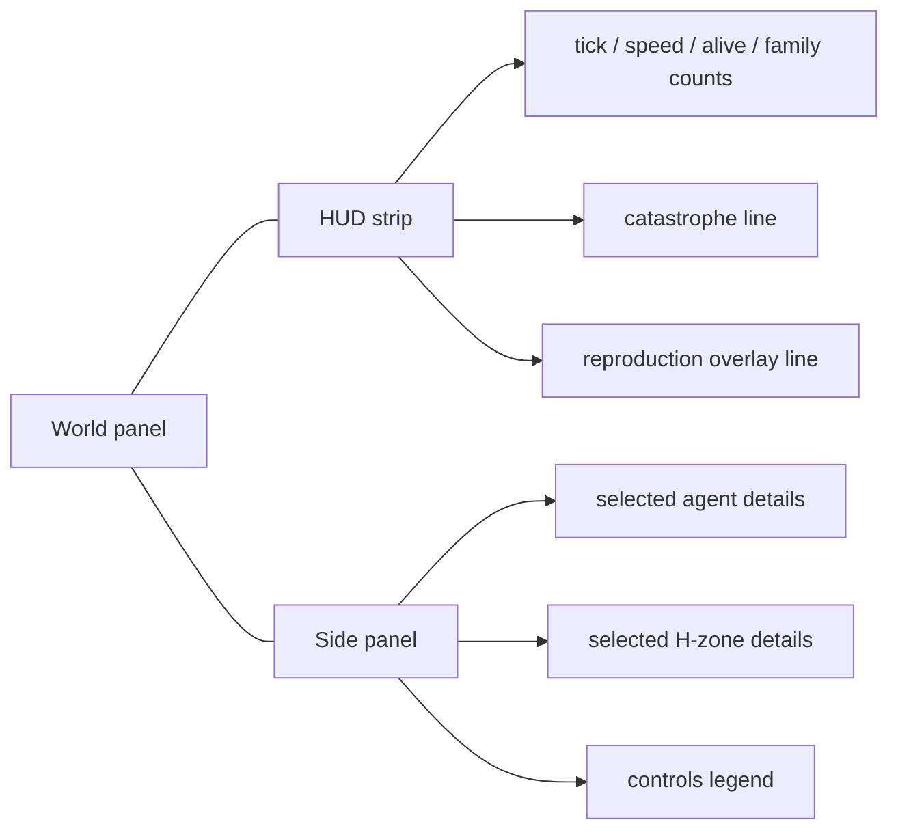

# Viewer HUD and Panels Atlas

> Owning document: [Viewer UI controls, HUD, and inspector manual](../../../05_operations/01_viewer_ui_controls_hud_and_inspector_manual.md)

## What this asset shows
- the major visual regions of the viewer

## What this asset intentionally omits
- exact pixel layout details

