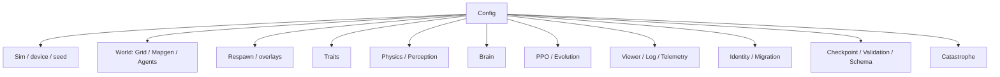

# Config Taxonomy Map

> Owning document: [Runtime config taxonomy and knob safety](../../../02_system/03_runtime_config_taxonomy_and_knob_safety.md)

## What this asset shows
- the main semantic config families
- where high-risk and compatibility-sensitive sections live

## What this asset intentionally omits
- every individual field

