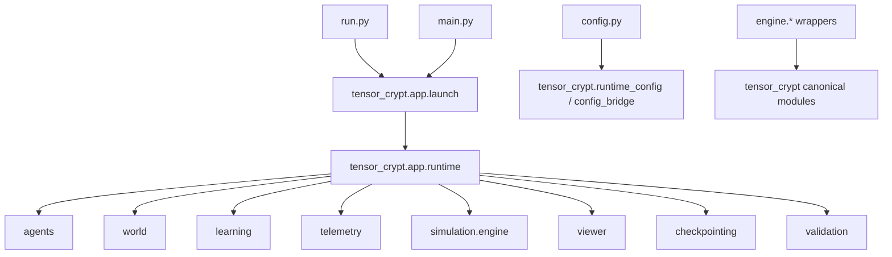

# Package and Compatibility Surface Map

> Owning document: [Package layout, canonical modules, and compatibility wrappers](../../../02_system/01_package_layout_canonical_modules_and_compatibility_wrappers.md)

## What this asset shows
- the canonical `tensor_crypt` regions and their responsibilities
- root-level public entry surfaces
- compatibility wrapper direction

## What this asset intentionally omits
- detailed call signatures
- intra-module algorithm details

