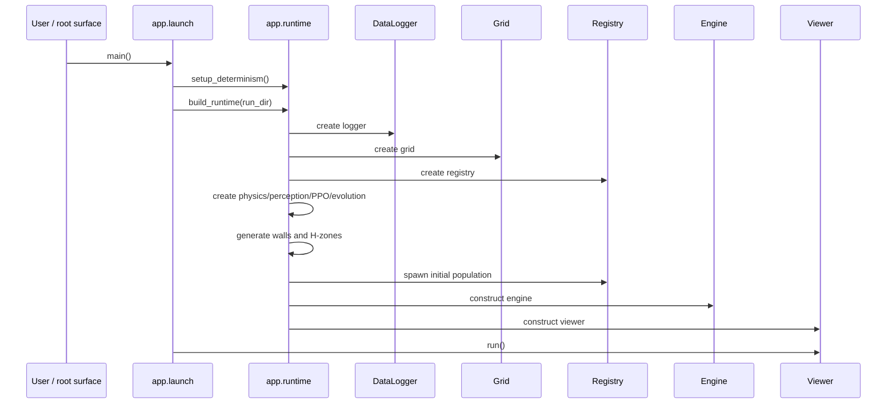

# Runtime Assembly Sequence

> Owning document: [Runtime assembly, launch sequence, and session graph](../../../02_system/02_runtime_assembly_launch_sequence_and_session_graph.md)

## What this asset shows
- startup ordering from launch to viewer
- stable construction sequence enforced by runtime assembly

## What this asset intentionally omits
- per-tick simulation behavior

