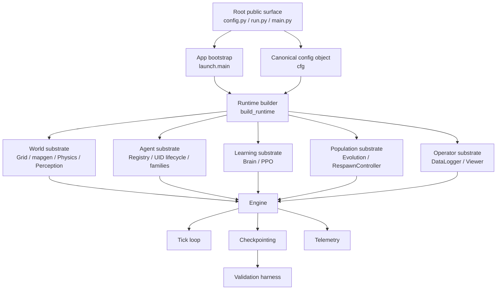
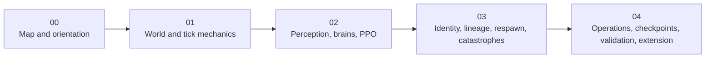

# The Map Before the Machine

This file is the orientation document for the Tensor Crypt technical document set. Its job is to make the repository legible before the reader studies internals. It names the major surfaces, shows how one run is assembled, separates simulation mechanics from learning and operator tooling, and gives a route through the remaining documents.

## What this file teaches

This file teaches the repository at map scale:

- what Tensor Crypt is, in practical terms
- which major subsystem families exist
- where the public entry surface ends and the internal package begins
- how one launched run becomes a live simulation
- which concepts matter early, and which can wait
- where each class of question belongs in the five-document set

## What this file does not try to teach

This file intentionally stops before deep detail. It does **not** try to fully teach:

- PPO mathematics or update derivations
- the exact neural-network topology of each brain family
- full tick-by-tick execution semantics
- the full respawn and mutation rule set
- the full catastrophe rule set
- the complete viewer control surface
- the full checkpoint schema or validation protocol
- exhaustive config reference material

Those topics exist in this repository. They simply belong later.

## What this repository is

Tensor Crypt is a package-based simulation codebase centered on a persistent agent population living on a grid world. The repository combines four distinct kinds of logic in one coherent run:

1. **world simulation** — grid state, walls, heal or harm zones, physics, and perception
2. **agent substrate** — slot storage, canonical UID identity, bloodline family binding, and lifecycle ledgers
3. **learning substrate** — per-UID brains, per-UID PPO state, rollout buffering, and update cadence
4. **operator surfaces** — viewer, logging, checkpointing, validation, and benchmark or soak utilities

A useful first mental model is this: Tensor Crypt is **not** just a viewer, **not** just a PPO trainer, and **not** just an evolutionary toy. It is a runtime that keeps a simulated world, a live population, a learning system, and an audit surface in sync.

## What lives inside the repository

The repository is easier to understand if you sort it by responsibility rather than by import path.

| Repository surface | Main role | Typical nouns you will meet |
|---|---|---|
| Root launch and config surface | Human entry into the system | `config.py`, `run.py`, `main.py` |
| App bootstrap and runtime assembly | Turns configuration into one concrete run | launch, runtime, build, determinism, run directory |
| World substrate | Owns the arena and low-level world state | grid, walls, h-zones, physics, perception |
| Agent substrate | Owns who exists and where they are bound | slot, UID, registry, family, lifecycle |
| Learning substrate | Owns policy/value inference and PPO state | brain, observation, logits, value, buffer, optimizer |
| Population substrate | Owns death finalization, reproduction, mutation, respawn | parent roles, trait latent, birth, policy noise |
| Catastrophe subsystem | Applies temporary world-shock behavior and scheduling | event, mode, duration, overlap, scheduler |
| Operator surface | Lets a human run, inspect, log, save, resume, and validate | viewer, logger, checkpoint, manifest, audit |

## Public surface vs internal surface

The repository is deliberately split between a small public root surface and a larger internal package surface.

### Public root surface

The root surface is intentionally thin.

| Surface | Purpose | What to assume |
|---|---|---|
| `config.py` | Public configuration entry surface | Re-exports the canonical package configuration for repository-root use |
| `run.py` | Primary launch entrypoint | This is the obvious human start path |
| `main.py` | Alternate thin launch entrypoint | Same launch boundary, different root name |
| compatibility packages | Preserve older import surfaces | Useful for backward compatibility, not for primary learning |

Two habits matter here.

First, treat root `config.py` as the public configuration entry surface, even though the canonical config implementation lives inside the package. Second, treat root launch files as **entry wrappers**, not as the place where simulation rules live.

### Internal package surface

The real implementation lives under the `tensor_crypt` package. At map level, the important internal areas are:

| Internal area | Role |
|---|---|
| `tensor_crypt.app` | bootstrap and runtime assembly |
| `tensor_crypt.world` | grid, map generation, perception, physics |
| `tensor_crypt.agents` | registry and brains |
| `tensor_crypt.learning` | PPO and training ownership |
| `tensor_crypt.population` | evolution, reproduction, respawn |
| `tensor_crypt.simulation` | engine orchestration and catastrophe manager |
| `tensor_crypt.telemetry` | logging, summaries, run artifacts |
| `tensor_crypt.checkpointing` | checkpoint capture, manifesting, restore |
| `tensor_crypt.audit` | determinism, resume, catastrophe, save-load-save probes |
| `tensor_crypt.viewer` | interactive runtime UI |

A third surface sits between these two worlds: the **config bridge**. Internal modules consume the canonical configuration through the package bridge, so the repository keeps one source of truth rather than multiple parallel config objects.

## One run from launch to live simulation

The easiest way to understand Tensor Crypt is to follow one normal run.

### Launch path

A typical launch begins at root `run.py` or `main.py`. Those files do not own simulation rules. They hand control to the package launch layer.

### Bootstrap path

The launch layer performs a small set of start-of-run duties:

- validate runtime-facing config combinations
- set deterministic seeds
- create the run directory
- print run diagnostics
- build the runtime
- start the viewer loop

### Runtime assembly path

The runtime builder is the main assembly boundary. It constructs the concrete object graph for one session:

- `DataLogger`
- `Grid`
- `Registry`
- `Physics`
- `Perception`
- `PPO`
- `Evolution`
- procedural map content
- initial population spawn
- `Engine`
- `Viewer`

This boundary matters because it is where the repository stops being a set of modules and becomes one running system.

### Live tick path

Once the viewer is running, it advances the engine tick loop. At high level, one non-empty tick proceeds in this order:

1. catastrophe scheduling and reversible world overrides are prepared
2. live-agent observations are built from the current world state
3. per-UID brains produce actions and values
4. physics applies actions and records collisions or contests
5. environmental effects are applied
6. PPO rewards are computed from current health state
7. deaths are processed and terminal ownership is finalized
8. evolution and respawn logic refill vacant slots when allowed
9. invariants and tick summaries are emitted
10. post-tick services may run: PPO update, snapshots, runtime checkpoint, progress print

That ordering is already enough for orientation. The purpose of this file is not to prove every step in detail, only to show that the run has a stable backbone.

## The major learning layers in this project

A beginner usually gets lost by mixing together four different kinds of questions. Tensor Crypt becomes much clearer once those layers are separated.

| Layer | What it asks | What belongs here | What does **not** belong here |
|---|---|---|---|
| **Simulation-world mechanics** | What exists in the arena and what physically happens? | grid, walls, h-zones, movement, collisions, health changes, death processing | PPO ownership, checkpoint manifests, viewer UI details |
| **Runtime architecture** | How is the run assembled and advanced? | launch path, runtime builder, engine orchestration, tick staging | reward derivation details, full config catalog |
| **Learning / neural mechanics** | How do agents perceive, decide, and update? | canonical observations, brain families, logits/value outputs, PPO buffers, updates | viewer panels, file manifests |
| **Operator / audit surfaces** | How does a human run and trust the system? | viewer, logging, checkpoints, manifests, validation probes, benchmark and soak utilities | raw collision mechanics, full mutation derivations |

One concept crosses all four layers: **identity ownership**.

Tensor Crypt stores live agent state densely by **slot** for runtime efficiency, but treats **UID** as the canonical identity for lineage, PPO ownership, checkpoint integrity, and historical ledgers. If you do not distinguish slot from UID, later documents will feel inconsistent even when the code is behaving correctly.

## How to read the five-document suite

The suite is designed as a staircase. Each document answers a different kind of question.

| Document | Role in the sequence |
|---|---|
| **00 — The Map Before the Machine** | Orientation, subsystem map, and reading strategy |
| **01 — The World, the Tick, and the Rules of Motion** | World substrate and the concrete flow of one simulation tick |
| **02 — Perception, Brains, and PPO Ownership** | Observation contract, brain families, inference, rollout state, and training flow |
| **03 — Identity, Lineage, Respawn, and Catastrophes** | UID lifecycle, parent roles, mutation, birth logic, extinction handling, catastrophe scheduling |
| **04 — Operating Tensor Crypt Safely** | Config surfaces, viewer operation, telemetry, checkpoints, validation, and safe extension rules |

Read them in order. The later documents assume the distinctions introduced here.

## Core vocabulary before proceeding

This glossary is intentionally short. It gives only the meaning needed to keep reading.

| Term | Map-level meaning |
|---|---|
| **slot** | A dense runtime position in the registry; efficient, reusable, and not the same as long-term identity |
| **UID** | The canonical agent identity used for lifecycle, lineage, PPO ownership, and checkpoint state |
| **registry** | The central slot-backed state store for live agents and UID bindings |
| **bloodline family** | A configured family label that determines the brain topology surface and visual family identity |
| **canonical observation** | The observation contract expected by the active brain surface |
| **tick** | One full engine advance step |
| **respawn controller** | The subsystem that decides whether and how empty slots become new agents |
| **parent roles** | The explicit split between brain parent, trait parent, and anchor parent during reproduction |
| **catastrophe** | A bounded world-shock event that temporarily changes field or runtime conditions |
| **checkpoint bundle** | A serialized runtime snapshot used for resume and audit workflows |
| **manifest** | The metadata file that validates a published checkpoint artifact set |
| **run directory** | The per-run artifact directory for logs, parquet files, checkpoints, and exported lineage data |

## Where to go for specific questions

The correct next document depends on the kind of question you are asking.

| Question | Go to |
|---|---|
| What actually happens during one tick? | **01 — The World, the Tick, and the Rules of Motion** |
| How do walls, h-zones, perception, and physics relate? | **01 — The World, the Tick, and the Rules of Motion** |
| How do the brains work at a structural level? | **02 — Perception, Brains, and PPO Ownership** |
| How do rewards, buffers, and PPO updates work? | **02 — Perception, Brains, and PPO Ownership** |
| Why does the code care so much about slot versus UID? | **03 — Identity, Lineage, Respawn, and Catastrophes** |
| How do respawn, mutation, parent roles, and family shifts work? | **03 — Identity, Lineage, Respawn, and Catastrophes** |
| What are catastrophes and where do they enter the run? | **03 — Identity, Lineage, Respawn, and Catastrophes** |
| Which config knobs should I touch first? | **04 — Operating Tensor Crypt Safely** |
| How do checkpoints, manifests, and restore order work? | **04 — Operating Tensor Crypt Safely** |
| How do validation probes and audit runners fit into trust in the system? | **04 — Operating Tensor Crypt Safely** |
| How should I extend the project without breaking invariants? | **04 — Operating Tensor Crypt Safely** |

## End-of-file recap

Before moving on, keep these five anchors in mind.

1. The repository exposes a **thin public root surface** and keeps real implementation in the package.
2. Root `config.py` is the **public human entry surface** for configuration, while the canonical implementation is consumed internally through the config bridge.
3. The runtime builder is the **assembly boundary** where modules become one concrete session.
4. The engine coordinates several distinct domains at once: **world rules, agent identity, learning ownership, population turnover, and operator logging**.
5. A **slot is not a UID**. That distinction is foundational for understanding PPO ownership, lineage, respawn, and checkpoints.

If those anchors are clear, the rest of the suite will feel finite rather than overwhelming.

## Read next

Read **01 — The World, the Tick, and the Rules of Motion** next.

That document should answer the first serious internal question a new reader usually asks: *what actually exists in the arena, and what exactly changes when the engine advances one tick?*
