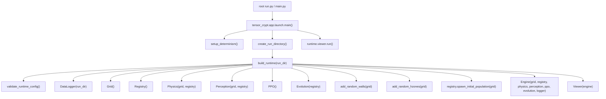
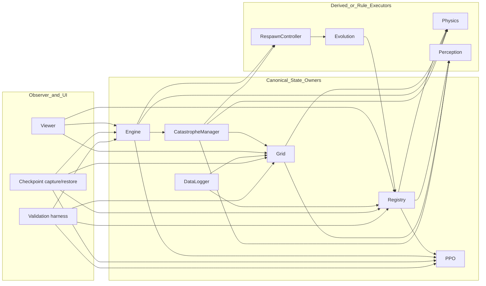
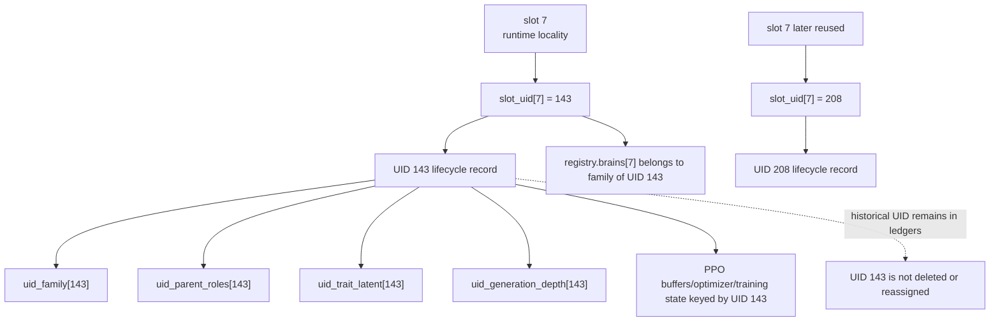
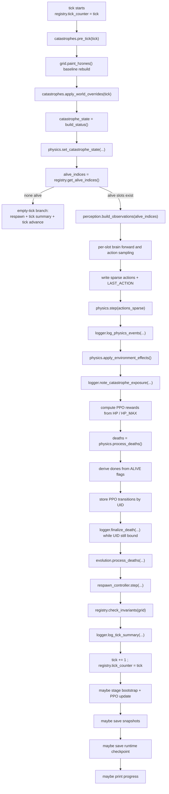
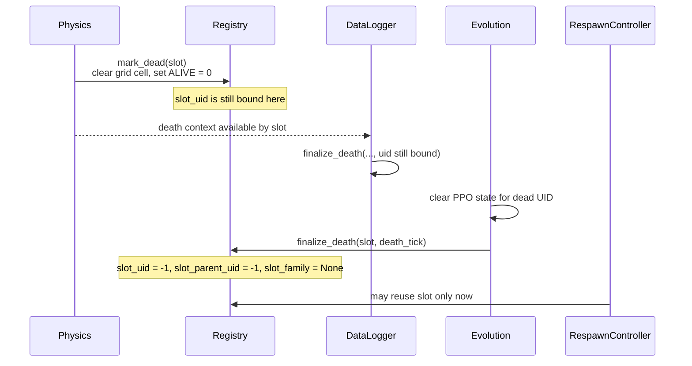

# The Runtime Atlas

This document is the architecture-truth file for Tensor Crypt. Its purpose is to explain how one run is actually assembled, which subsystem owns which category of state, where execution order becomes semantically important, and which invariants a maintainer must preserve when changing internals. It treats the current codebase as implementation truth and concentrates on ownership, lifecycle, and state flow rather than beginner intuition, mathematics, or operator workflow.

## What this file teaches

- where the public repository surface ends and the implementation package begins
- how launch, configuration, runtime construction, and the live object graph fit together
- which modules own canonical state, which modules derive from that state, and which modules are observers only
- how dense slot tensors, canonical UIDs, bloodline families, brains, and PPO ownership interact
- the exact high-level order of one engine tick
- the boundary between death, death finalization, and legal slot reuse
- how respawn and catastrophes act as runtime subsystems rather than as narrative game features
- where telemetry, checkpoints, and validation observe the machine
- how to route modifications to the correct subsystem without collateral semantic drift

## What this file deliberately leaves for later

- full PPO derivation, advantage math, and optimizer-level explanation
- a plain-English mechanics manual
- a full `config.py` knob reference
- viewer keybinds and operator controls
- benchmarking interpretation and profiling guidance
- catastrophe flavor text or design commentary beyond runtime behavior
- end-user run instructions already covered by root entrypoints and other documents

## Repository surface and architectural entrypoints

### Public root surface

The repository keeps a small public surface at root and pushes real implementation into the package.

| Surface | Runtime role | Notes |
|---|---|---|
| `config.py` | canonical user configuration surface | re-exports `tensor_crypt.runtime_config` |
| `run.py` | obvious public launch surface | delegates to `tensor_crypt.app.launch.main()` |
| `main.py` | alternate public launch surface | also delegates to `tensor_crypt.app.launch.main()` |
| root `engine` package stub | legacy import compatibility | extends import path so imports such as `engine.physics` continue to resolve into `src/engine` thin re-exports |
| root `tensor_crypt` namespace bridge | implementation-package compatibility | extends import path so `import tensor_crypt.*` works from repository root while canonical code lives under `src/tensor_crypt` |

The important architectural point is that the repository root is a compatibility and user-entry layer, not the place where simulation rules live.

### Internal package surface

The implementation package is `tensor_crypt`. The package is not a loose folder tour; it is a set of ownership domains:

| Import surface | Architectural role |
|---|---|
| `tensor_crypt.app.launch` | launch-time bootstrap only |
| `tensor_crypt.app.runtime` | runtime assembly and config validation |
| `tensor_crypt.config_bridge` | stable access path to the single `cfg` object |
| `tensor_crypt.agents.brain` | canonical brain architecture and observation-shape contract |
| `tensor_crypt.agents.state_registry` | canonical agent state backbone and UID lifecycle ownership |
| `tensor_crypt.world.spatial_grid` | canonical world tensor and H-zone field |
| `tensor_crypt.world.perception` | observation construction from canonical state |
| `tensor_crypt.world.physics` | movement, collision, damage, and death detection |
| `tensor_crypt.learning.ppo` | UID-owned rollout, optimizer, and update state |
| `tensor_crypt.population.evolution` | death finalization and mutation helpers |
| `tensor_crypt.population.respawn_controller` | birth scheduling, parent-role selection, and slot reuse gate |
| `tensor_crypt.simulation.engine` | tick order, phase boundaries, and attachment points |
| `tensor_crypt.telemetry.data_logger` | run artifacts and permanent ledgers |
| `tensor_crypt.checkpointing.runtime_checkpoint` | capture, validate, save, and restore runtime substrate |
| `tensor_crypt.audit.final_validation` | determinism, resume, catastrophe, and save/load validation probes |
| `tensor_crypt.viewer.main` and related viewer modules | interactive observer and control UI |

### Configuration bridge pattern

`runtime_config.Config` is the single aggregate configuration object. Root `config.py` exposes it publicly, and the implementation consumes the same object through `tensor_crypt.config_bridge.cfg`. That matters because there is no second internal configuration authority.

The aggregate surface is explicit and sectioned. The code exposes sections such as:

`SIM`, `GRID`, `MAPGEN`, `AGENTS`, `TRAITS`, `PHYS`, `PERCEPT`, `BRAIN`, `RESPAWN`, `PPO`, `EVOL`, `VIEW`, `LOG`, `IDENTITY`, `SCHEMA`, `CHECKPOINT`, `TELEMETRY`, `VALIDATION`, `MIGRATION`, and `CATASTROPHE`.

That arrangement gives the runtime one stable control plane while keeping internal modules free of root-directory assumptions.

## How one run is assembled

The launch path is intentionally thin.

### Launch path

`tensor_crypt.app.launch.main()` owns only launch-time concerns:

- determinism setup
- run-directory creation
- startup prints
- runtime assembly
- viewer start

It explicitly does **not** own simulation rules.

### Runtime validation before assembly

`tensor_crypt.app.runtime.validate_runtime_config()` rejects unsupported combinations before the machine starts. In the current codebase, the runtime explicitly constrains several surfaces rather than silently supporting many modes:

- `SIM.DTYPE` must be `float32`
- CUDA cannot be requested if unavailable
- `AGENTS.SPAWN_MODE` must be `uniform`
- `TRAITS.METAB_FORM` must be `affine_combo`
- `BRAIN.INITIAL_FAMILY_ASSIGNMENT` must be `round_robin` or `weighted_random`
- `RESPAWN.MODE` must be `binary_parented`
- `RESPAWN.ANCHOR_PARENT_SELECTOR`, `RESPAWN.EXTINCTION_POLICY`, and `RESPAWN.BIRTH_HP_MODE` must come from explicit supported sets
- `GRID.HZ_OVERLAP_MODE`, `PHYS.TIE_BREAKER`, and `TELEMETRY.LINEAGE_EXPORT_FORMAT` must come from explicit supported sets
- `PPO.OWNERSHIP_MODE` must be `uid_strict`
- `CATASTROPHE.DEFAULT_MODE` and `CATASTROPHE.AUTO_STATIC_ORDERING_POLICY` must come from explicit supported sets
- manifest strictness and latest-pointer features require actual manifest publication (`ATOMIC_WRITE_ENABLED`, `MANIFEST_ENABLED`, and `SAVE_CHECKPOINT_MANIFEST`)
- logging cadence, checkpoint cadence, batch-size, and catastrophe-duration values must satisfy basic numeric constraints

These checks are architectural. They show which modes are real runtime contracts and which modes are not presently supported.

### Determinism setup

`setup_determinism()` seeds Python `random`, NumPy, and PyTorch. When CUDA is available it also sets CUDA seeds and deterministic CuDNN settings. That establishes one reproducible launch boundary before any map generation or initial spawn happens.

### Assembly order

`build_runtime(run_dir)` is semantically ordered:

1. validate config
2. create `DataLogger`
3. create `Grid`
4. create `Registry`
5. create `Physics`
6. create `Perception`
7. create `PPO`
8. create `Evolution`
9. generate the procedural map on the grid
10. spawn the initial population into empty slots and free cells
11. create the `Engine`
12. create the `Viewer`

That order is not cosmetic. Map generation must happen before initial spawn. Initial spawn must happen before engine creation because the engine bootstraps telemetry from already-live UIDs. Viewer construction is last because it is an observer over an already-assembled engine.

## The runtime object and its subsystem graph

`tensor_crypt.app.runtime` returns a `SimulationRuntime` dataclass. It is the assembled graph for one launched session, not a second orchestrator.

### Runtime object

| Field | Meaning |
|---|---|
| `run_dir` | filesystem root for this run’s artifacts |
| `data_logger` | telemetry and durable artifact writer |
| `grid` | canonical world tensor and H-zone substrate |
| `registry` | canonical agent-state and identity substrate |
| `physics` | world-consequence resolver |
| `perception` | observation constructor |
| `ppo` | UID-owned learning state |
| `evolution` | death finalization and mutation helper surface |
| `engine` | tick owner and phase-order owner |
| `viewer` | interactive observer and control UI |

### Ownership map

### State owner vs observer vs control vs validation

| Category | Primary modules | Meaning |
|---|---|---|
| simulation state owners | `Registry`, `Grid`, `Engine`, `PPO`, `CatastropheManager` | canonical state that defines the run |
| rule executors | `Physics`, `Perception`, `Evolution`, `RespawnController` | modules that transform or derive from owned state |
| observer surfaces | `Viewer`, `DataLogger` | read the machine and emit UI or artifacts |
| control surfaces | root `config.py`, `cfg`, `app.launch`, `app.runtime`, viewer input | determine launch conditions, runtime mode, and UI actions |
| validation surfaces | `checkpointing.runtime_checkpoint`, `validation.final_validation`, soak/benchmark harnesses | inspect or compare runtime state against structural expectations |

The important distinction is that the viewer and logger are **not** authorities for simulation truth. They attach to an already-owned runtime.

## The state backbone: slots, UIDs, and ownership

The central architectural fact of the repository is that runtime execution is slot-dense, but identity is UID-canonical.

### Two different coordinate systems exist at once

- **slot index**: dense runtime locality inside tensors and per-slot lists
- **UID**: monotonic canonical identity for ownership, lineage, PPO state, and checkpoint semantics

A slot is not an agent’s permanent identity. A UID is.

### What the registry actually owns

`tensor_crypt.agents.state_registry.Registry` owns the agent backbone.

#### Dense slot-backed surfaces

`Registry.data` is a dense tensor with column semantics such as:

- `ALIVE`
- `X`, `Y`
- `HP`, `HP_MAX`
- `LAST_ACTION`
- `MASS`
- `VISION`
- `METABOLISM_RATE`
- `AGENT_UID_SHADOW`
- `TICK_BORN`
- `PARENT_UID_SHADOW`
- `HP_GAINED`
- `HP_LOST_PHYSICS`
- `OPTIMIZATION_CYCLE`

`Registry.brains` is a per-slot list. A live slot may hold a live brain instance. Empty or finalized slots may hold `None`.

#### Canonical identity surfaces

The registry also owns:

- `slot_uid`: current UID bound to each slot, or `-1`
- `slot_parent_uid`: current parent UID shadow for each slot, or `-1`
- `active_uid_to_slot`: live UID-to-slot map
- `uid_lifecycle`: lifecycle ledger for every allocated UID
- `uid_family`: bloodline family ledger by UID
- `uid_parent_roles`: parent-role ledger by UID
- `uid_trait_latent`: latent trait ledger by UID
- `uid_generation_depth`: lineage depth ledger by UID
- `slot_family`: slot-local family cache
- `next_agent_uid`: monotonic allocator

The ledger surfaces are canonical. They outlive slot reuse.

### UID lifecycle record

Each allocated UID gets an `AgentLifecycleRecord` with:

- `uid`
- `parent_uid`
- `birth_tick`
- `death_tick`
- `current_slot`
- `is_active`

This is the historical backbone. A UID may become inactive and historical, but it never becomes a new UID again.

### Why slot reuse is architecture-sensitive

The runtime uses slots for speed, but the project explicitly forbids recycling canonical ownership state when a slot is reused.

That is why the registry has both:

- a **dense slot layer** for execution
- a **historical UID layer** for ownership and lineage

A slot becomes reusable only after canonical UID finalization clears the binding.

### UID vs slot diagram

### Shadow identity columns

The registry can mirror UIDs and parent UIDs into legacy float columns through `AGENT_UID_SHADOW` and `PARENT_UID_SHADOW` when `cfg.IDENTITY.MIRROR_UIDS_TO_LEGACY_FLOAT_COLUMNS` is enabled. These are compatibility surfaces, not the canonical identity authority.

### Brain placement and family binding

Brains are stored per slot, but their semantic family belongs to the UID ledger.

- `uid_family[uid]` is the canonical family binding
- `slot_family[slot]` is a cache derived from the UID binding
- `ensure_slot_brain_family(slot, family_id)` ensures the slot holds a brain instance of the correct family
- `assert_identity_invariants()` checks that every live slot has a brain and that the brain family matches the UID family

That means brain placement is runtime-local, but brain identity is still downstream of UID ownership.

## How one tick flows through the machine

`tensor_crypt.simulation.engine.Engine` owns tick order. This is the place where subsystem boundaries become actual runtime semantics.

### Tick-order flowchart

### Pre-tick world staging

At the top of each step the engine sets `registry.tick_counter` and then runs a deterministic catastrophe staging boundary:

1. `catastrophes.pre_tick(self.tick)`
2. `grid.paint_hzones()`
3. `catastrophes.apply_world_overrides(self.tick)`

This order matters. Baseline H-zone state is rebuilt first. Catastrophe overlays are then applied as reversible runtime modifications on top of that baseline.

After that, the engine builds catastrophe status and passes it into physics through `physics.set_catastrophe_state(...)`.

### Perception and policy path

If live slots exist:

- the engine reads live slot indices from the registry
- `Perception.build_observations(alive_indices)` constructs the observation batch
- the engine runs `_sample_actions(...)`

A crucial detail is that inference is not performed as a single shared-brain batch. `_batched_brain_forward(...)` iterates the live slots and calls the slot’s own brain instance. The surrounding tensors are batched by slot, but module ownership remains per live UID/slot binding.

### Action application boundary

The engine then:

- writes actions into a sparse per-slot tensor
- records `LAST_ACTION` in registry state
- runs `physics.step(actions_sparse)`

From that point onward the consequences are world-rule consequences, not policy outputs.

### World consequence and reward boundary

After `physics.step(...)`:

- collision events are logged
- `physics.apply_environment_effects()` applies environment-driven HP changes
- catastrophe exposure is noted for telemetry
- PPO reward is computed from current `HP` and `HP_MAX`

This means reward capture happens **after** the main physical step and environment effects, but **before** canonical UID finalization.

### Death processing boundary

The engine then calls `physics.process_deaths()`. At this point some slots may already have `ALIVE = 0.0`, but canonical UID binding has not yet been retired.

The engine immediately derives `dones` from the current `ALIVE` flags and stores transitions into PPO by canonical UID ownership. If a slot died, `ppo.finalize_terminal_uid(uid)` stages a terminal buffer tail for that UID.

Only after transition storage does the engine finalize telemetry death rows through `logger.finalize_death(...)`, still using the currently bound UID.

### Finalization, respawn, and post-tick surfaces

After death telemetry rows are written:

1. `evolution.process_deaths(...)` clears PPO state for dead UIDs and calls `registry.finalize_death(...)`
2. `respawn_controller.step(...)` may reuse newly finalized dead slots
3. `registry.check_invariants(grid)` validates the settled state
4. tick summary is logged
5. tick counter advances
6. the engine may run PPO update, snapshots, and runtime checkpoint publication

The machine therefore has a deliberate two-part ending:

- **pre-increment settled world**
- **post-increment learning/checkpoint side effects**

### Empty-population branch

If there are no live agents, the engine does not attempt perception, policy forward, or PPO storage. It still:

- builds catastrophe status
- passes status to physics
- runs respawn
- logs tick summary
- advances the tick counter

That branch matters because binary-parented respawn cannot infer parents from an empty living set unless extinction recovery policy creates new root-like seeds.

## Death, finalization, and slot reuse

Death is not a single instant in this repository. There are at least three distinct boundaries.

### Death timeline

### Boundary 1: physical death

`Registry.mark_dead(...)` clears the grid cell and sets `ALIVE = 0.0`. This is a physical and occupancy transition, not canonical identity retirement.

### Boundary 2: death telemetry finalization

`DataLogger.finalize_death(...)` expects the dead slot to **still** have a bound UID. It opens or updates the life ledger row, records death information, and captures training-state fields before the UID disappears from active ownership.

This is why the logger call happens before evolution finalization.

### Boundary 3: canonical UID retirement

`Evolution.process_deaths(...)` is the canonical finalization boundary.

For each dead slot it:

- computes a fitness update from `HP_GAINED`
- verifies the dead slot still has a bound UID
- clears PPO state for that UID
- calls `registry.finalize_death(dead_idx, death_tick, ...)`

`registry.finalize_death(...)` is the point where:

- `death_tick` is written into the lifecycle record
- `current_slot` becomes `None`
- `is_active` becomes `False`
- `active_uid_to_slot` entry is removed
- `slot_uid` becomes `-1`
- `slot_parent_uid` becomes `-1`
- `slot_family` becomes `None`

Only after this point is the slot legally unbound.

### Legal slot reuse condition

`RespawnController.step(...)` enforces a hard gate before spawning:

- pending-finalization slots are defined as `(ALIVE <= 0.5) & (slot_uid >= 0)`
- if any such slot exists, respawn raises an assertion rather than reusing the slot

The slot reuse rule is therefore explicit:

> a dead slot is not reusable merely because `ALIVE == 0`; it becomes reusable only after canonical UID finalization clears `slot_uid`

That is one of the highest-value invariants in the codebase.

## Respawn as a runtime subsystem

`tensor_crypt.population.respawn_controller.RespawnController` is not just a helper. It is a runtime actor with its own gates, timing, and catastrophe-facing modifier surface.

### What it owns

The controller owns:

- respawn cadence (`RESPAWN_PERIOD`)
- maximum births per cycle
- `last_respawn_tick`
- runtime reproduction gate override
- runtime mutation overrides supplied by catastrophes

It does **not** own the canonical agent ledger. It coordinates births through the registry and evolution helpers.

### Trigger conditions

Respawn returns early unless one of the configured population gates requests action. The controller considers:

- current alive count
- `POPULATION_FLOOR`
- `POPULATION_CEILING`
- respawn period timing
- catastrophe-driven reproduction disable
- number of available dead-and-finalized slots

### Dead-slot eligibility

Eligible dead slots are explicitly those with:

- `ALIVE <= 0.5`
- `slot_uid < 0`

This is the same slot-reuse invariant described earlier. The controller refuses to blur physical death and canonical finalization.

### Parent-role selection

For non-extinction births, the controller resolves three parent roles:

- `brain_parent_uid`
- `trait_parent_uid`
- `anchor_parent_uid`

These roles are recorded in the child’s UID ledger. The brain parent is also the canonical parent used at allocation time.

The runtime consequence is important:

- lineage is not stored as a single ambiguous parent pointer
- brain inheritance, trait inheritance, and placement anchoring can diverge while still being recorded explicitly

### Birth path

For each new child, the controller:

1. selects parent roles
2. resolves the active parent slots from UIDs
3. resolves a placement result
4. mutates the trait latent
5. resolves the child family, including optional family shift
6. ensures the child slot has a brain of the correct family
7. if the child family matches the brain parent family, copies the parent brain state into the child slot brain
8. applies policy noise to the child brain
9. calls `registry.spawn_agent(...)` with explicit family, parent roles, trait latent, birth tick, and birth HP
10. emits a structured spawn telemetry row

The registry remains the canonical state owner; respawn is the orchestrator of the birth event.

### Extinction handling

If the live population drops below the point where binary parented reproduction is possible, the controller switches to configured extinction policy:

- `fail_run`
- `seed_bank_bootstrap`
- `admin_spawn_defaults`

The bootstrap paths create fresh births with parent roles all set to `-1`, a configured family, default latent traits, and free-cell placement.

That is a runtime recovery surface, not a normal parented birth path.

## Catastrophes as bounded runtime overrides

The catastrophe system is designed as a bounded, reversible overlay system rather than as a permanent mutation of canonical world definitions.

### Design contract

The catastrophe manager’s own module comment states the doctrine clearly:

- catastrophes are explicit bounded events
- baseline zone definitions remain canonical
- temporary world shocks are rebuilt each tick from active event state
- apply, update, and revert happen through runtime overlays rather than permanent substrate mutation

### Scheduler role

`CatastropheManager.pre_tick(tick)` is the scheduling boundary. It handles:

- event expiry
- end-event logging
- possible automatic event triggering
- mode logic such as off/manual/auto variants
- overlap and concurrency gates

This happens before the engine repaints baseline H-zones and before runtime overrides are applied.

### Override application role

`CatastropheManager.apply_world_overrides(tick)` is the effect boundary. On every tick it:

1. resets runtime modifiers on `Physics`, `Perception`, and `RespawnController`
2. clones the current baseline H-zone field
3. folds all active catastrophe events into:
   - transient field edits
   - vision scaling
   - collision damage scaling
   - metabolism scaling
   - mass burden
   - reproduction enable/disable
   - mutation override scalars
4. writes the resulting field back into `grid.grid[1]`
5. pushes the runtime modifiers into the owning subsystems

This is why catastrophes are reversible. There is no need to permanently mutate stored trait values or canonical zone definitions.

### Which subsystems catastrophes can affect

| Surface | Effect type |
|---|---|
| `Grid` | transient H-zone field rewriting |
| `Perception` | runtime `vision_scale` |
| `Physics` | collision and metabolism multipliers, catastrophe state for death-context attribution |
| `RespawnController` | reproduction enable gate and mutation override scalars |
| `DataLogger` | exposure and survival tracking by catastrophe event id |
| `Viewer` | catastrophe status panel and optional overlay data derived from current status |

### Checkpoint visibility

When enabled, catastrophe state is serialized into runtime checkpoints and restored on resume. That makes catastrophe scheduling and active-window state part of the checkpoint-visible runtime substrate.

## Where logging, checkpointing, and validation attach

These systems do not own simulation rules, but they observe structurally important surfaces.

### Logging and telemetry attachment points

`DataLogger` attaches at several boundaries:

- **engine initialization**: `bootstrap_initial_population(registry)` opens life rows for already-spawned initial UIDs and logs root-seed births when deep ledgers are enabled
- **after physics step**: `log_physics_events(...)`
- **after environment effects**: catastrophe exposure is updated from current active event ids
- **before UID retirement**: `finalize_death(...)`
- **after tick settles**: `log_tick_summary(...)`
- **periodic snapshots**: `log_agent_snapshot(...)`, `log_heatmap_snapshot(...)`, `log_brains(...)`
- **run close**: final flush, optional open-life finalization, lineage export, file-handle close

The logger is therefore an observer over canonical state and phase boundaries. It is deliberately placed before and after certain state transitions because those boundaries change what identity data still exists.

### Runtime checkpoint attachment points

The engine publishes runtime checkpoints only after the post-tick state has settled.

`Engine._maybe_save_runtime_checkpoint()` explicitly states its intent:

> publish a post-tick checkpoint only after physics, deaths, births, and PPO state settle

Checkpoint capture reads from a narrow substrate view containing:

- `registry`
- `grid`
- `ppo`
- `engine`

The captured bundle includes:

- engine tick and respawn checkpoint-visible state
- catastrophe state when configured
- registry dense data and UID ledgers
- grid tensor and H-zone definitions
- active brain state by UID plus brain metadata
- PPO buffers, training state, optimizer state, and scaler state as configured
- RNG state as configured
- config snapshot and schema versions

Restore order is conservative and intentional:

1. restore registry state and UID ledgers
2. rebuild active UID-to-slot bindings
3. reinstantiate brains for active UIDs
4. restore grid
5. restore engine tick and respawn last tick
6. restore PPO buffers and optimizer state
7. restore RNG
8. restore catastrophe state
9. re-run identity and registry invariants

The restore order is part of the ownership contract. PPO state is not restored before the active UID substrate exists.

### Validation attachment points

The validation harness observes the runtime through signatures rather than through ad hoc prints.

`tensor_crypt.audit.final_validation` compares surfaces such as:

- tick
- `active_uid_to_slot`
- `slot_uid`
- `slot_parent_uid`
- `uid_family`
- `uid_generation_depth`
- catastrophe status
- digests of registry data, fitness, and grid tensors
- brain-state digests by active UID
- PPO update counts, buffer sizes, optimizer UID set

The soak audit performs additional structural checks such as:

- registry invariants
- finite registry and grid tensors
- PPO buffers and optimizers keyed only by known UIDs
- finite brain parameters
- checkpoint save/load surface consistency

Validation therefore attaches to the same canonical surfaces the architecture treats as semantically meaningful.

## Critical invariants

> These are the surfaces a maintainer should not casually break.

1. **Slot is locality; UID is identity.**  
   Slot indices exist for dense runtime execution. UIDs own lineage, family, PPO state, checkpoint semantics, and historical identity.

2. **A dead slot is not automatically a reusable slot.**  
   `ALIVE == 0` is only physical death. Legal reuse requires canonical finalization so that `slot_uid == -1`.

3. **Every active UID must map to exactly one active slot.**  
   The registry asserts bijection between live slot bindings and `active_uid_to_slot`.

4. **Every live slot must hold a family-consistent brain.**  
   A live slot with a missing brain or mismatched family is a registry invariant failure.

5. **The observation schema is a cross-module contract.**  
   `Perception`, `Brain`, PPO storage, and checkpoint metadata all depend on canonical observation shapes and ordering remaining aligned.

6. **PPO ownership is UID-strict, not slot-strict.**  
   Buffers, optimizers, and training counters belong to UIDs. A slot change or slot reuse must not silently transfer ownership.

7. **Death telemetry precedes UID retirement.**  
   Logger death finalization happens while the dead slot still has a canonical UID binding. Moving that boundary will change what information is available to telemetry.

8. **Respawn may only consume fully finalized slots.**  
   The respawn controller asserts against dead-but-still-bound slots.

9. **Catastrophe overrides are temporary overlays, not permanent world rewrites.**  
   Baseline H-zone definitions remain canonical. Runtime modifiers are rebuilt each tick.

10. **Checkpoint restore order is semantically meaningful.**  
    Registry bindings must exist before brains are reattached; brains must exist before PPO optimizer state is restored.

11. **Grid occupancy and registry position/alive state must agree.**  
    When no stacking is enabled, the registry invariants require one live slot per occupied grid cell and reciprocal agreement between grid and registry.

12. **Post-tick checkpoints are taken from settled state, not from a mid-phase snapshot.**  
    Changing checkpoint timing changes what “resume” means.

## Where to modify what safely

Use the ownership map, not naming intuition.

| Goal | Primary module(s) | Do not start by changing | Why |
|---|---|---|---|
| change launch or runtime assembly | `tensor_crypt.app.launch`, `tensor_crypt.app.runtime` | `Engine.step()` | launch/bootstrap and tick semantics are different layers |
| change config structure or supported runtime modes | `tensor_crypt.runtime_config`, `tensor_crypt.config_bridge`, `validate_runtime_config()` | random call sites first | control-plane drift is easiest to introduce centrally |
| change canonical agent identity behavior | `tensor_crypt.agents.state_registry` | viewer or logger code | identity truth lives in the registry, not in observers |
| change brain topology or family contracts | `tensor_crypt.agents.brain` | PPO or viewer code | topology and family consistency are brain-layer contracts |
| change observation contents or normalization | `tensor_crypt.world.perception` and related config | `Brain.forward()` only | the observation contract is produced upstream |
| change world geometry or H-zone substrate | `tensor_crypt.world.spatial_grid`, `tensor_crypt.world.procedural_map` | catastrophe code first | baseline world ownership belongs to grid and map generation |
| change movement, collision, damage, or environment effects | `tensor_crypt.world.physics` | respawn or logger code | physics is the consequence resolver |
| change tick order, reward boundary, checkpoint cadence, or observer attachment points | `tensor_crypt.simulation.engine` | subsystem internals first | those are engine-owned sequencing decisions |
| change PPO storage/update ownership semantics | `tensor_crypt.learning.ppo` | registry slot tensors alone | PPO state is keyed by UID and validated against registry ownership |
| change death finalization behavior | `tensor_crypt.population.evolution` together with `Registry.finalize_death()` | respawn code alone | death retirement spans canonical identity and PPO cleanup |
| change reproduction, parent-role selection, or birth mutation | `tensor_crypt.population.respawn_controller`, `tensor_crypt.population.reproduction`, `tensor_crypt.population.evolution` | `Registry.spawn_agent()` first | the controller orchestrates births; the registry commits them |
| change catastrophe scheduling or runtime override logic | catastrophe manager module and engine catastrophe boundary | grid or physics in isolation | catastrophe behavior is a cross-subsystem overlay surface |
| change telemetry outputs or permanent ledgers | `tensor_crypt.telemetry.data_logger`, lineage export helpers | registry logic | logger observes canonical state; it does not define it |
| change checkpoint schema or restore rules | `tensor_crypt.checkpointing.runtime_checkpoint`, `atomic_checkpoint` | engine only | checkpoint capture/restore is its own substrate contract |
| change validation expectations | `tensor_crypt.audit.final_validation`, soak harnesses | production logic first | validation should encode the intended contract, not accidentally replace it |
| change viewer presentation or interaction | `tensor_crypt.viewer.*` | engine/physics/registry ownership code | viewer is an observer and control UI, not a simulation authority |

## End-of-file recap

Tensor Crypt is assembled from a thin public root surface into a package-owned runtime graph. The machine is anchored by two canonical substrates: the `Grid` for world state and the `Registry` for slot-backed agent state plus UID-ledger identity. `Engine` owns tick order and the places where subsystems meet. `Physics` resolves consequences. `Perception` derives the observation contract. `PPO` owns learning state by UID, not by slot. `Evolution` and `RespawnController` divide death finalization from legal birth reuse. `CatastropheManager` applies reversible runtime overlays rather than permanently rewriting the baseline world. `DataLogger`, checkpoint capture, and validation all attach to these same canonical surfaces.

If a maintainer keeps those ownership boundaries clear, the repository remains understandable. If those boundaries are blurred, the first failures will usually appear as UID drift, slot-reuse bugs, broken checkpoint restores, or silent observation/brain mismatch.

## Read next

Read the next document in the technical document set that covers learning internals and training mathematics. This runtime atlas stops at architecture, lifecycle, and ownership boundaries; the next file should take over at observation semantics, PPO mechanics, and learning-state interpretation.
