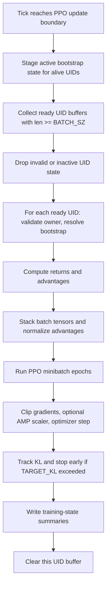
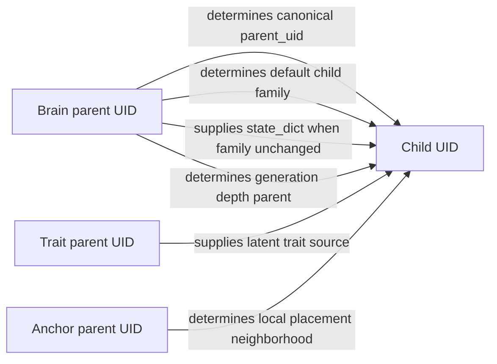

# The Learning and Lineage Notebook

This file documents the learning substrate of Tensor Crypt: the observation contract, the bloodline MLP families, the PPO ownership model, the reward surface, and the reproduction/lineage mechanics that determine how policies and traits propagate through births. It is written against the current codebase as implementation truth. The goal is not to restate generic reinforcement-learning theory, but to explain **what this repository actually does** and which invariants must remain stable if the system is to stay interpretable.

## What this file teaches

This notebook explains five tightly coupled surfaces.

1. The observation contract: what a live agent can see, how those tensors are shaped, and how the canonical and legacy pathways relate.
2. The neural surface: what the bloodline families consume, how their trunks differ, and what the actor and critic heads emit.
3. The PPO surface: who owns rollout state, what is stored, how bootstrap closure works, how returns and advantages are computed, and how updates are scheduled.
4. The trait surface: how latent trait state is represented, how it becomes realized phenotype, and how mutation alters it.
5. The lineage surface: how binary parent roles are split between policy inheritance, trait inheritance, and offspring placement.

## What this file deliberately leaves for later

This file does **not** serve as the world-mechanics manual, the runtime-assembly atlas, the viewer handbook, or the checkpoint/telemetry operations guide. It assumes the reader already knows the broad runtime shape of the simulation and now needs a precise map of the learning and inheritance machinery.

## The learning surface in this repository

Tensor Crypt’s learning loop is easiest to read as a single ownership chain:

```text
world state
   -> perception builds canonical observations
   -> one UID-owned brain produces logits and value
   -> physics and environment change the world
   -> reward and done are computed from post-step state
   -> transition is appended to that UID's PPO buffer
   -> active UIDs may stage bootstrap state at update boundaries
   -> PPO updates only buffers that are ready and still UID-valid
   -> deaths finalize UID lifecycle state
   -> births create new UIDs using split parent roles
```

Two principles govern the whole design.

First, **slot storage is not identity**. Runtime tensors are dense and slot-indexed for speed, but learning ownership, optimizer ownership, brain ownership, parent-role semantics, and checkpoint restoration are all defined in terms of canonical monotonic UIDs.

Second, **bloodline is architectural, not cosmetic**. A family is not just a label or color. It fixes a real policy/value topology, and that topology is treated as a checkpoint-visible invariant.

---

## The observation contract

The observation system has a canonical contract and a legacy bridge. The live brain is written against the canonical contract. The legacy path exists only to adapt older observation surfaces into that contract when fallback is allowed.

### Canonical batch structure

For a batch of `B` live agents, the canonical observation payload is:

```text
canonical_rays    : [B, 32, 8]
canonical_self    : [B, 11]
canonical_context : [B,  3]
```

With current defaults:

- `NUM_RAYS = 32`
- `CANONICAL_RAY_FEATURES = 8`
- `CANONICAL_SELF_FEATURES = 11`
- `CANONICAL_CONTEXT_FEATURES = 3`

That means one agent’s canonical observation contains:

- `32 x 8 = 256` ray features
- `11` self features
- `3` context features

Total canonical scalar width after flattening is therefore:

```text
256 + 11 + 3 = 270
```

### Observation-contract diagram

```text
per-agent canonical observation

canonical_rays [32, 8]
  ├─ geometric / contact / local field signal per direction
  └─ flattened to 256 values before MLP mixing

canonical_self [11]
  ├─ current health state
  ├─ realized phenotype state
  ├─ position / age
  └─ local zone state

canonical_context [3]
  ├─ alive fraction
  ├─ mean normalized mass of global alive set
  └─ mean HP ratio of global alive set
```

### Canonical per-ray semantics

The canonical ray caster emits the following feature order for each of the 32 rays:

| Ray index | Meaning |
|---|---|
| 0 | `hit_none` |
| 1 | `hit_agent` |
| 2 | `hit_wall` |
| 3 | `hit_distance_norm` |
| 4 | `path_zone_peak_rate_norm` |
| 5 | `terminal_zone_rate_norm` |
| 6 | `target_mass_norm` |
| 7 | `target_hp_ratio` |

This is not a generic “vision embedding.” It is an explicit structured sensor surface.

A few details matter:

- `hit_distance_norm` is normalized by the observing agent’s effective vision range.
- `path_zone_peak_rate_norm` is the maximum absolute zone-rate magnitude encountered along the ray path, normalized by `ZONE_RATE_ABS_MAX` and signed.
- `terminal_zone_rate_norm` is the normalized zone rate at the ray’s terminal hit point or terminal sampled point.
- `target_mass_norm` and `target_hp_ratio` are only populated when the ray actually hits another agent.
- `hit_none`, `hit_agent`, and `hit_wall` are mutually resolving first-hit indicators.

### Canonical self semantics

The canonical self vector has width 11 and is assembled in this order:

| Self index | Meaning |
|---|---|
| 0 | `hp_ratio` |
| 1 | `hp_deficit_ratio` |
| 2 | `mass_norm` |
| 3 | `hp_max_norm` |
| 4 | `vision_norm` |
| 5 | `metabolism_norm` |
| 6 | `x_norm` |
| 7 | `y_norm` |
| 8 | `dist_center_norm` |
| 9 | `age_norm` |
| 10 | `current_zone_rate_norm` |

This vector mixes three kinds of information into one compact surface:

- **state-of-body**: health, deficit, mass, HP ceiling, vision, metabolism
- **state-of-place**: normalized position and distance from center
- **state-of-time/local field**: age and current zone rate

### Canonical context semantics

The canonical context vector has width 3:

| Context index | Meaning |
|---|---|
| 0 | `alive_fraction` |
| 1 | `mean_mass_norm` |
| 2 | `mean_hp_ratio` |

The context surface is built from the global alive set. By default, that global set is the same as the currently observed alive set, but the builder accepts an explicit `global_alive_indices` override.

### Why the split exists

The canonical contract splits the observation into three semantically distinct blocks:

- **rays** hold directional local sensing,
- **self** holds agent-local scalar state,
- **context** holds population-level summary state.

That split matters because two bloodline families do not flatten everything the same way. The split-input families project rays and scalars separately before mixing them.

### What the brain sees after flattening or mixing

For non-split families, the effective input path is:

```text
canonical_rays [B,32,8] -> flatten -> [B,256]
canonical_self [B,11]
canonical_context [B,3]
concat all -> [B,270]
input projection -> first hidden width
```

For split-input families, the path is:

```text
canonical_rays [B,32,8] -> flatten -> [B,256] -> ray_proj
canonical_self [B,11] + canonical_context [B,3] -> [B,14] -> scalar_proj
concat projected branches -> optional input gate -> input_proj
```

### Legacy observation adaptation

The repository still supports a legacy observation surface when `ALLOW_LEGACY_OBS_FALLBACK` is enabled. The legacy payload is:

```text
rays     : [B, 32, 5]
state    : [B,  2]
genome   : [B,  4]
position : [B,  2]
context  : [B,  3]
```

The adapter maps those tensors into the canonical surface. The mapping is exact and asymmetric.

#### Legacy-to-canonical ray bridge

```text
canonical[...,1] <- legacy rays[...,0]   # hit_agent
canonical[...,2] <- legacy rays[...,1]   # hit_wall
canonical[...,3] <- legacy rays[...,2]   # distance_norm
canonical[...,4] <- legacy rays[...,4]   # path_zone_peak_rate_norm
canonical[...,6] <- legacy rays[...,3]   # target_mass_norm
canonical[...,0] <- clamp(1 - hit_agent - hit_wall, 0, 1)
```

Two important consequences follow.

- Canonical ray index `5` (`terminal_zone_rate_norm`) is not reconstructed from the legacy surface.
- Canonical ray index `7` (`target_hp_ratio`) is not reconstructed from the legacy surface.

Those channels therefore remain at their zero-initialized values on the legacy bridge.

#### Legacy-to-canonical self/context bridge

```text
canonical_self[0]    <- legacy state[0]     # hp_ratio
canonical_self[1]    <- 1 - hp_ratio        # hp_deficit_ratio
canonical_self[2:6]  <- legacy genome       # mass/hp_max/vision/metabolism proxy block
canonical_self[6:8]  <- legacy position
canonical_self[8]    <- legacy context[0]   # dist_center_norm
canonical_self[9]    <- legacy context[1]   # age_norm
canonical_self[10]   <- legacy state[1]     # current_zone_rate_norm

canonical_context[0] <- legacy context[2]   # alive_fraction
```

Canonical context indices `1` and `2` (`mean_mass_norm`, `mean_hp_ratio`) are not reconstructed by the legacy bridge and remain zero-initialized there.

### Contract validation surfaces

The brain rejects observation drift explicitly.

Canonical validation requires:

- `canonical_rays` rank 3 with shape `[B, 32, 8]`
- `canonical_self` rank 2 with shape `[B, 11]`
- `canonical_context` rank 2 with shape `[B, 3]`
- all three tensors must share the same batch size `B`

Legacy validation similarly checks rank and final-width expectations before adaptation.

### Why shape drift matters here

In this repository, observation shape is not a loose convention. It is part of the brain-family topology contract and part of checkpoint compatibility. Silent schema drift would damage:

- family input projections,
- serialized buffers,
- checkpoint-visible topology signatures,
- tests that explicitly reject malformed canonical inputs.

> **Invariant**  
> The live brain contract is canonical. Legacy observations are tolerated only through an explicit adapter path.

---

## What the brains consume and produce

The policy/value network surface is deliberately simple in interface and deliberately strict in ownership.

### Input contract

Every brain instance consumes a dictionary-like observation payload, extracts canonical observations, and returns:

```text
logits : [B, 9]
value  : [B, 1]
```

That remains true for every bloodline family.

### Action semantics

`ACTION_DIM = 9`, and the physics layer interprets actions using a fixed direction table:

| Action index | Meaning |
|---|---|
| 0 | stay in place |
| 1 | north |
| 2 | north-east |
| 3 | east |
| 4 | south-east |
| 5 | south |
| 6 | south-west |
| 7 | west |
| 8 | north-west |

So the actor head emits logits over nine discrete movement choices. The critic head emits one scalar value estimate per agent.

### Empty-batch behavior

The brain handles empty batches explicitly. If `B = 0`, it returns empty tensors shaped `[0, 9]` and `[0, 1]`. This matters because the engine and perception code both preserve explicit empty-batch pathways.

---

## The bloodline family architecture surface

Every active UID owns a brain that belongs to exactly one bloodline family. Within a family, topology is shape-identical. Across families, topology may differ in hidden widths, activation, normalization placement, gating, and input mixing.

### Stable family set and order

The valid family order is:

1. House Nocthar
2. House Vespera
3. House Umbrael
4. House Mourndveil
5. House Somnyr

This order is not decorative. It affects:

- root-family round-robin assignment,
- family-aware PPO update ordering,
- any code that iterates families in configured order.

### Common invariants across all families

All families share the following invariants.

- They are canonical MLP brains, not transformers.
- They consume the canonical observation contract.
- They emit `[B,9]` actor logits and `[B,1]` critic values.
- They end with a `head_norm = LayerNorm(final_width)` before actor/critic heads.
- Their actor head is `Linear -> activation -> Linear(9)`.
- Their critic head is `Linear -> activation -> Linear(1)`.
- Their topology signatures are treated as checkpoint-visible invariants.

### Family comparison table

| Family | Hidden widths | Activation | Norm placement | Residual width-preserving blocks | Gated | Split inputs | Split widths | Dropout | Approx. params |
|---|---:|---|---|---|---|---|---|---:|---:|
| House Nocthar | 256, 256, 224, 192 | GELU | pre | yes | no | no | — | 0.00 | 379,626 |
| House Vespera | 160, 160, 160, 128, 128 | SiLU | pre | yes | no | no | — | 0.00 | 235,818 |
| House Umbrael | 320, 320, 224 | ReLU | post | yes | no | no | — | 0.00 | 468,650 |
| House Mourndveil | 224, 224, 192 | SiLU | pre | yes | yes | yes | ray 160, scalar 96 | 0.00 | 437,642 |
| House Somnyr | 256, 256, 256, 224, 192 | GELU | pre | yes | yes | yes | ray 192, scalar 128 | 0.02 | 810,090 |

### Residual vs transition stages

The trunk is built stage by stage from adjacent hidden widths.

- If `residual=True` **and** the stage preserves width, the code uses a width-preserving residual block.
- Otherwise it uses a transition block that changes width.

So residual usage is conditional on both the family setting and the width schedule.

### Residual block behavior

A residual block performs:

```text
x -> optional pre-LayerNorm -> Linear -> activation -> dropout -> Linear
  -> optional gate(x) via sigmoid
  -> add residual
  -> optional post-LayerNorm
```

Gating is multiplicative and only exists in the gated families.

### Transition block behavior

A transition block performs:

```text
x -> optional pre-LayerNorm -> Linear(width change) -> activation -> dropout -> optional post-LayerNorm
```

### Split-input families

Mourndveil and Somnyr are the only split-input families.

They do **not** consume the flattened `[B,270]` vector directly. Instead they do the following.

```text
ray_flat [B,256]   -> ray_proj
scalar_flat [B,14] -> scalar_proj
concat projected branches
optional input gate
input_proj -> first hidden width
```

That means the canonical rays/self/context split is not only conceptually useful. It changes actual family topology.

### Family assignment and inheritance

Root UIDs may be assigned by:

- `round_robin`, or
- `weighted_random`

Parented births inherit the brain parent’s family unless family-shift mutation explicitly changes it.

### Why family is a hard learning surface

The checkpoint layer validates per-UID brain metadata against expected topology signatures for the family. In practical terms, family drift is treated as a real schema problem, not as a loose semantic label.

> **Invariant**  
> In this repository, bloodline family is a real architecture selector. It is not flavor text.

---

## Reward shaping and reward gating

The PPO reward surface is intentionally narrow.

### Base reward form

The engine currently validates only one reward form:

```math
r_t = \left(\mathrm{clip}\left(\frac{HP_t}{\max(HP\_MAX_t, \varepsilon)}, 0, 1\right)\right)^2
```

with `\varepsilon = 1e-6` for denominator safety.

So the base reward is simply the squared current health ratio, measured **after** physics and environment effects are applied for the tick.

### Reward gating modes

The gate surface supports three modes:

- `off`
- `hp_ratio_min`
- `hp_abs_min`

If the gate is off, the reward is just the base reward.

If the gate is on, the engine computes a boolean gate mask and returns:

```math
r_t =
\begin{cases}
\text{base\_reward}_t, & \text{if gate condition holds} \\
\text{REWARD\_BELOW\_GATE\_VALUE}, & \text{otherwise}
\end{cases}
```

The two supported gate conditions are:

- `hp_ratio_min`: `HP / HP_MAX >= threshold`
- `hp_abs_min`: `HP >= threshold`

### Repository-specific implication

This is not a kill reward, a sparse victory reward, or a hand-composed weighted sum over many events. The PPO surface is explicitly tied to *survival health state*, with optional suppression below a threshold.

That matters for interpretation:

- policy learning is pushed toward maintaining health,
- catastrophic field exposure affects learning indirectly through HP and survival,
- combat and wall damage matter because they push HP down,
- healing zones matter because they push HP up and therefore raise reward.

---

## PPO state ownership and rollout structure

This is one of the most important repository-specific sections.

### Ownership model

PPO state is owned by **canonical UID**, not by slot.

That includes:

- rollout buffers,
- optimizers,
- bootstrap state,
- training counters,
- last-update summaries.

Slots are only the runtime place where the currently active brain tensor lives.

### Why UID ownership exists

Slots are reused. UIDs are not. A slot can die, be finalized, and later host a different child UID. If PPO state were slot-owned, optimizer state and rollout history could silently leak across distinct agents. The current repository explicitly prevents that.

### Rollout unit

The basic rollout unit is **one UID-owned buffer**.

A buffer stores the transition history for one UID across its active life segment until either:

- it is closed by terminal death,
- it is closed by active bootstrap staging at an update boundary,
- it is cleared early,
- or it becomes update-eligible and is trained.

### Buffer structure

Each `_AgentBuffer` stores:

```text
observations   : list[dict]
actions        : list[tensor]
log_probs      : list[tensor]
rewards        : list[tensor]
values         : list[tensor]
dones          : list[tensor]
bootstrap_obs  : dict | None
bootstrap_done : tensor | None
finalization_kind : str
```

The list lengths must remain equal across all transition fields.

### Buffer lifecycle diagram

```text
UID buffer
  pending transitions
      |
      +-- terminal death -----------------> stage_bootstrap(None, done=1, "terminal_death")
      |
      +-- active update boundary ---------> stage_bootstrap(next_obs, done=0, "active_bootstrap")
      |
      +-- early drop / clear -------------> may count as truncated rollout
      |
      +-- ready for PPO update -----------> returns/advantages -> optimize -> clear buffer
```

### Transition storage

For each originally alive slot in the current tick, the engine stores:

- that agent’s observation slice,
- sampled action,
- sampled log-probability,
- post-step reward,
- critic value from the pre-step observation,
- done flag after death processing.

The transition is appended to the buffer belonging to the current UID bound to that slot.

### Terminal closure

If the current transition is terminal, the engine explicitly calls `finalize_terminal_uid(uid)`, which stages:

```text
bootstrap_obs  = None
bootstrap_done = 1.0
finalization_kind = "terminal_death"
```

That gives the buffer an explicit terminal tail.

### Active bootstrap closure

At PPO update time, the engine first stages bootstrap state for all currently alive UIDs with nonempty buffers.

The staged state is:

- a fresh post-tick observation for that still-active UID,
- `bootstrap_done = 0.0`,
- `finalization_kind = "active_bootstrap"`.

This is how non-terminal trajectories are closed for GAE computation.

### Terminal vs non-terminal closure

The repository distinguishes these cases explicitly.

- **Terminal death closure** uses `done = 1` and no bootstrap observation.
- **Active bootstrap closure** uses `done = 0` and a staged next observation whose value will be queried.

That distinction is not optional bookkeeping. It directly controls whether value bootstrapping is allowed.

### What happens to dead UID buffers

A very important repository-specific detail is easy to miss.

After deaths are processed, `Evolution.process_deaths(...)` does two things for each dead slot:

1. it updates the slot’s `fitness` surface using `HP_GAINED`, and
2. it calls `ppo.clear_agent_state(dead_uid)` before final UID retirement.

With the current default PPO settings, inactive UID buffers are dropped after finalization. So although terminal death is staged explicitly, dead UID PPO state is then cleared during death processing.

Mechanically, that means the update path is driven primarily by buffers that still belong to active UIDs when the scheduled PPO update boundary arrives.

### Truncated-rollout counting

If a buffer is dropped while it is nonempty and not properly terminally closed, the repository can count it as a truncated rollout. That counter is stored in the UID’s training state.

> **Invariant**  
> A PPO buffer is a UID-owned trajectory fragment, not a slot-owned circular log.

---

## Returns, advantages, and update flow

Tensor Crypt uses generalized advantage estimation in a repository-specific way that is worth reading carefully.

### Bootstrap resolution

Before return computation, the update path resolves a `(last_value, last_done)` pair from the buffer’s staged closure state.

The logic is:

1. empty buffer -> `(0, 1)`
2. bootstrap state present and `bootstrap_done >= 0.5` -> `(0, done)`
3. bootstrap state present and non-terminal -> run the current brain on `bootstrap_obs` and use its value
4. terminal tail without staged bootstrap -> `(0, 1)`
5. non-terminal buffer without staged bootstrap -> error if strict bootstrap is required

### GAE recurrence as implemented here

For a rollout with rewards `r_t`, values `V_t`, done flags `d_t`, and final bootstrap pair `(V_{last}, d_{last})`, the code iterates backward and uses:

```math
\delta_t = r_t + \gamma \cdot V_{boot} \cdot (1 - d_{gate}) - V_t
```

```math
GAE_t = \delta_t + \gamma \lambda (1 - d_{gate}) \cdot GAE_{t+1}
```

```math
R_t = GAE_t + V_t
```

with:

- for the final transition, `V_boot = last_value` and `d_gate = last_done`
- otherwise, `V_boot = values[t+1]` and `d_gate = dones[t]`

The repository comment calls out the subtle point explicitly: the bootstrap gate must use the **current transition’s** terminal flag so that advantages do not leak across death or other done boundaries.

### Returns/advantages timeline sketch

```text
t=0        t=1        t=2        ...        t=T-1        bootstrap
 o0  ->     o1  ->     o2  ->                  oT-1  ->   oT or terminal
 a0         a1         a2                       aT-1
 r0         r1         r2                       rT-1
 V0         V1         V2                       VT-1       Vboot
 d0         d1         d2                       dT-1       dboot

backward pass:
  use (Vboot, dboot) for final transition
  use (V_{t+1}, d_t) for earlier transitions
```

### Batch collation

Once returns and advantages are computed, the update path collates:

- stacked observation tensors by key,
- stacked actions,
- stacked old log-probs,
- stacked old values,
- stacked returns,
- stacked advantages.

Advantages are normalized by batch mean and standard deviation.

### PPO objective as implemented here

For each minibatch, the code computes:

```math
ratio = \exp(\log \pi_\theta(a|s) - \log \pi_{old}(a|s))
```

```math
L_{policy} = -\mathbb{E}[\min(ratio \cdot A, \mathrm{clip}(ratio, 1-\epsilon, 1+\epsilon) \cdot A)]
```

The value loss is the clipped PPO-style critic loss:

```math
L_{value} = 0.5 \cdot \mathbb{E}[\max((V_\theta - R)^2, (V_{clipped} - R)^2)]
```

Total loss is:

```math
L = L_{policy} + c_v L_{value} - c_e H
```

where `c_v = VALUE_COEF`, `c_e = ENTROPY_COEF`, and `H` is categorical entropy.

### Update scheduling and ordering

A UID buffer is ready only if:

- its length is at least `BATCH_SZ`, and
- the UID is still active.

If `FAMILY_AWARE_UPDATE_ORDERING=True`, ready UIDs are grouped by family and processed in configured `FAMILY_ORDER`. This affects update order only. It does **not** change per-UID ownership or merge buffers across a family.

### Update flowchart



### KL stopping and gradient clipping

The implementation supports:

- early stopping when approximate KL exceeds `TARGET_KL`,
- global gradient clipping by `GRAD_NORM_CLIP`,
- optional AMP scaling when CUDA AMP is enabled.

### One repository-specific conclusion

This is **PPO over live UID-owned buffers**, not PPO over a global replay slab, and not a shared-optimizer population update.

Each active UID may own:

- its own optimizer,
- its own update counter,
- its own rollout history,
- its own KL/value/policy diagnostics.

---

## Training-state bookkeeping

Per-UID training summaries live in `AgentTrainingState`.

The tracked fields are:

| Field | Meaning |
|---|---|
| `env_steps` | number of transitions stored for that UID |
| `ppo_updates` | number of PPO updates completed |
| `optimizer_steps` | optimizer steps taken across updates |
| `truncated_rollouts` | count of early-dropped non-terminal buffers |
| `last_kl` | last approximate KL observed |
| `last_entropy` | last entropy summary |
| `last_value_loss` | last critic loss summary |
| `last_policy_loss` | last policy loss summary |
| `last_grad_norm` | last clipped gradient norm |
| `last_buffer_size` | buffer size used in last update |
| `last_update_tick` | tick of the last update |

These summaries are keyed by UID and are serializable for checkpointing.

Training state is always tracked for each live UID in the current runtime. There is no separate `TRACK_TRAINING_STATE` toggle in the live config surface.

---

## Trait latent space and phenotype mapping

The lineage surface does **not** inherit realized trait values directly. It inherits and mutates a latent budgeted allocation state.

### Default latent representation

The default latent payload is:

```text
budget
z_hp
z_mass
z_vision
z_metab
```

The default initialization is a budget plus four logits:

- `budget = INIT_BUDGET`
- `z_* = INIT_LOGITS`

### Trait-latent-to-trait mapping diagram

```text
latent state
  budget, z_hp, z_mass, z_vision, z_metab
        |
        v
softmax over logits -> allocation fractions
        |
        v
alpha_i = min(1, budget * alloc_i)
        |
        v
lerp into clamp ranges for hp_max / mass / vision / metab_base
        |
        v
metab = metab_base + base + mass*per_mass + vision*per_vision
        |
        v
final realized phenotype
```

### Allocation rule

Let

```math
\mathbf{z} = [z_{hp}, z_{mass}, z_{vision}, z_{metab}]
```

Then the repository computes:

```math
\mathbf{a} = \mathrm{softmax}(\mathbf{z})
```

and uses a clamped budget allocation per trait:

```math
\alpha_i = \min(1, budget \cdot a_i)
```

Those `\alpha_i` values are then used to linearly interpolate inside each trait’s allowed clamp range.

### Clamp ranges in the current codebase

The current trait clamp ranges are:

| Trait | Clamp range |
|---|---|
| mass | `[0.5, 8.0]` |
| vision | `[4.0, 16.0]` |
| hp_max | `[5.0, 100.0]` |
| metab | `[0.01, 0.4]` |

The budget itself is clamped to:

```text
MIN_BUDGET = 0.25
MAX_BUDGET = 1.75
```

### Realized metabolism is not a simple direct lerp

The metabolism path is slightly richer than the others.

The code first computes a clamped `metab_base` by lerping inside the metabolism clamp range, then applies an affine correction:

```math
metab = metab_{base} + base + mass \cdot per\_mass + vision \cdot per\_vision
```

with current coefficients:

- `base = 0.0002`
- `per_mass = 0.0001`
- `per_vision = 0.00002`

The result is then clamped back into the allowed metabolism range.

### What is inherited mechanically

The registry stores both:

- `uid_trait_latent[uid]` — the latent genotype-like state,
- realized runtime trait columns in the slot tensor — mass, HP max, vision, metabolism.

Births use the latent state as the inherited source of trait information, not the slot tensor alone.

---

## Mutation, rare mutation, and family shift

Mutation in this repository spans more than one surface.

It can change:

- latent trait logits,
- latent budget,
- policy parameters via additive noise,
- and optionally the bloodline family itself.

### Ordinary mutation path

The normal mutation path perturbs:

- each trait logit by Gaussian noise with `TRAIT_LOGIT_MUTATION_SIGMA`,
- the budget by Gaussian noise with `TRAIT_BUDGET_MUTATION_SIGMA`.

Current defaults:

| Surface | Default |
|---|---:|
| ordinary trait-logit sigma | `0.12` |
| ordinary budget sigma | `0.05` |
| ordinary policy-noise SD | `0.01` |

### Rare mutation path

Rare mutation is entered with probability:

```text
RARE_MUT_PROB = 0.0005
```

When the rare path is taken, the repository uses the larger rare-path sigmas:

| Surface | Default |
|---|---:|
| rare trait-logit sigma | `0.40` |
| rare budget sigma | `0.15` |
| rare policy-noise SD | `0.03` |

So rare mutation is not just a flag. It changes both latent drift scale and policy-parameter noise scale.

### Policy noise surface

After family handling and possible parameter copying, the child brain receives additive Gaussian noise across parameters. The standard deviation comes from:

- `POLICY_NOISE_SD` on the ordinary path,
- `RARE_POLICY_NOISE_SD` on the rare path,

optionally scaled by runtime mutation overrides.

### Family-shift mutation

Family-shift mutation exists as a real code path, but it is disabled by default in the current configuration:

- `ENABLE_FAMILY_SHIFT_MUTATION = False`
- `FAMILY_SHIFT_PROB = 0.0001`

If enabled and sampled, the child family is chosen from a random family different from the current brain parent family.

### Why family shift is more than relabeling

If the child family differs from the brain parent family, the code does **not** copy the parent `state_dict` into the child. State copying only occurs when:

```text
child_family == brain_parent_family
```

So a family-shift birth is not a same-topology noisy clone. It is an architectural jump into a different family surface, followed by that family’s own initialization and then policy noise.

### Mutation summary diagram

```text
trait parent latent
   -> mutate logits and budget
   -> decode realized traits

brain parent family
   -> usually inherit same family
   -> optionally shift family

brain parameters
   -> if same family: copy parent weights
   -> then apply policy noise
```

---

## Binary parenting and lineage mechanics

This repository uses **binary parented reproduction with three explicit parent roles**.

### Parent-role diagram



### The three roles

#### 1. Brain parent

The brain parent determines:

- the child’s canonical `parent_uid` in the lifecycle ledger,
- the child’s generation depth ancestor,
- the default inherited family,
- the policy parameter source when the family is unchanged.

This is the mechanically privileged lineage role.

#### 2. Trait parent

The trait parent determines:

- which latent trait payload is inherited,
- therefore which trait logits and budget are mutated into the child’s new latent state,
- and therefore the realized phenotype after decoding.

#### 3. Anchor parent

The anchor parent determines:

- the spatial neighborhood used for local offspring placement.

The placement routine searches shuffled square-ring candidates around the anchor parent, subject to wall, occupancy, and harm-zone constraints, with optional global fallback.

### Overlay doctrines layered onto binary parenting

Binary parenting is the substrate. Three optional overlays constrain it without replacing the three-role model:

- The Ashen Press is a crowding gate on the anchor neighborhood. It can block a birth or force global placement fallback when the chosen anchor is surrounded too tightly.
- The Widow Interval is a UID-scoped refractory overlay for recently used parents. Because it keys by UID rather than slot, slot reuse does not corrupt lineage eligibility.
- The Bloodhold Radius builds the candidate pool from living agents near the dead slot being refilled. It can either fall back to global selection or fail that one birth slot strictly.

When all three doctrines are disabled, parent selection and placement revert to the legacy binary-parent behavior. When floor recovery is active, each doctrine has its own softening policy so emergency recovery can stay possible without silently erasing operator intent.

### Canonical lineage meaning of `parent_uid`

A crucial mechanical point:

The child UID is allocated with `parent_uid = brain_parent_uid`.

So the canonical lifecycle ledger and the legacy shadow parent UID columns both record the **brain parent**, not the trait parent and not the anchor parent.

If a reader forgets that fact, lineage interpretation becomes incorrect immediately.

### Parent-role selection logic

The repository selects roles from currently alive slots.

- **Brain parent eligibility** is based on `registry.fitness[slot]` meeting a minimum threshold, unless floor recovery suspends thresholds.
- **Trait parent eligibility** is based on minimum HP ratio and minimum age in ticks, again subject to floor-recovery overrides.
- **Anchor parent** is chosen by a configured mode:
  - `brain_parent`
  - `trait_parent`
  - `random_parent`
  - `fitter_of_two`

The current default anchor selector is `trait_parent`.

### One subtlety about the fitness surface

The visible writes in the current codebase show that `registry.fitness[slot]` is:

- reset to `0.0` at spawn, and
- updated during death processing as `fitness * FITNESS_DECAY + HP_GAINED`.

That is the exact slot-local surface the brain-parent selector reads.

### Generation depth

Generation depth is incremented from the brain parent only:

```text
generation_depth(child) = generation_depth(brain_parent) + 1
```

Root seeds start at depth 0.

### Birth phenotype and birth HP

After latent mutation and decoding, the child receives realized trait values for:

- mass,
- HP max,
- vision,
- metabolism.

Birth HP is then assigned by the configured birth mode:

- `full` -> newborn HP equals newborn HP max
- `fraction` -> newborn HP equals `hp_max * BIRTH_HP_FRACTION`

The current default is `full`.

### Offspring placement implications

Placement is not arbitrary.

By default, the child is placed:

- in shuffled ring neighborhoods with radius 1 through 4 around the anchor parent,
- with a maximum of 32 local attempts,
- not on walls,
- not on occupied cells,
- not in negative-rate harm zones,
- with optional fallback to a globally free cell.

So anchor selection changes not only visualization of “who the parent was,” but the literal spatial pressure under which a lineage begins life.

### Extinction recovery

If the population falls below the minimum needed for binary reproduction, the controller can either fail the run or bootstrap default root-like spawns, depending on `EXTINCTION_POLICY`.

In bootstrap recovery, the child is spawned with:

- all three parent roles set to `-1`,
- a configured bootstrap family,
- default latent trait state,
- a realized phenotype decoded from that default latent state.

---

## Mental models for learning and inheritance

A few mental models make the system easier to reason about.

### 1. Observation is structured sensing, not a flat feature bag

The rays, self block, and context block are distinct on purpose. Two families exploit that distinction architecturally. Treating the observation as just a length-270 vector misses an important design boundary.

### 2. A living agent is a UID with a temporary slot body

The slot is where the body currently lives. The UID is who owns the learning state. If the slot changes occupant, optimizer state must not follow the slot.

### 3. Bloodline is architecture plus inheritance path

A family determines which neural topology the child can inhabit. Family shift therefore changes the *kind* of brain, not just its label.

### 4. Survival pressure is the main PPO signal

The base reward is squared health ratio. Many world events matter only because they perturb health and therefore future viability and reward.

### 5. Policy lineage and trait lineage are intentionally decoupled

The child can inherit policy from one parent and phenotype from another. This is the repository’s most distinctive lineage design choice.

### 6. Anchor lineage is environmental, not informational

The anchor parent does not donate weights or latent traits. It donates *birth geography*. In a spatial simulation, that is still a real inheritance pressure.

---

## Common technical misunderstandings

### Misunderstanding 1: slot identity and learning identity are the same

They are not. Slots are dense runtime containers. UIDs own brains, buffers, optimizers, counters, and lineage semantics.

### Misunderstanding 2: family differences are just theme or visualization

They are not. Families fix different hidden-width plans and, for some families, different input mixing and gating behavior.

### Misunderstanding 3: canonical and legacy observations are interchangeable

They are not. The live brain expects canonical observations. The legacy path is only a compatibility adapter, and it leaves some canonical channels zero-filled because the legacy surface does not contain those signals.

### Misunderstanding 4: PPO here is a generic shared-population trainer

It is not. The implementation is UID-strict. Buffers and optimizers are keyed by canonical UID, and ready updates are collected per UID.

### Misunderstanding 5: mutation only changes traits

It does not. Mutation can alter latent trait state, add policy noise, and optionally shift family.

### Misunderstanding 6: the three parent roles are redundant

They are not. Brain parent controls policy lineage and canonical parenthood, trait parent controls latent inheritance, and anchor parent controls spatial birth context.

### Misunderstanding 7: `parent_uid` means the trait donor

It does not. The canonical `parent_uid` is the **brain parent UID**.

### Misunderstanding 8: bootstrap logic is just a textbook afterthought

It is not. This repository explicitly distinguishes active bootstrap closure from terminal closure, and strict bootstrap staging is part of the safety contract.

### Misunderstanding 9: dead UID trajectories persist naturally into later PPO updates

Not under the current settings. Terminal closure is staged, but death processing also clears dead UID PPO state. That is part of the current implementation truth.

### Misunderstanding 10: observation-shape drift would be easy to fix later

It would not. Shape drift propagates into brain input projections, serialized buffers, tests, and checkpoint topology validation.

---

## End-of-file recap

Tensor Crypt’s learning system is built around a small number of very strong invariants.

- The live observation contract is canonical and structured: rays, self, context.
- The brain surface is a family-indexed MLP system with stable actor/critic outputs.
- PPO ownership is canonical-UID based, not slot-based.
- Reward is squared health ratio with optional threshold gating.
- Returns and advantages are computed with explicit bootstrap handling and clipped PPO losses.
- Trait inheritance operates through a latent budget-plus-logit space, not direct raw trait copying.
- Binary reproduction splits policy lineage, trait lineage, and placement lineage into separate roles.
- The child’s canonical parent is the brain parent.
- Family shift is an architectural mutation, not a cosmetic mutation.

If those invariants are held in mind, the learning and lineage surfaces become much easier to extend without silently damaging semantics.

## Read next

Read the fifth file in the suite next: the operational and extension-oriented document covering checkpoints, telemetry, viewer/runtime surfaces, and safe modification boundaries. This notebook explains **how agents learn and inherit**. The next document should explain **how to operate, observe, resume, and extend the system without breaking those learning contracts**.
